# Sasori - System Architecture


## Table of Contents

1. [What is Sasori?](#1-what-is-sasori)
2. [System Overview](#2-system-overview)
3. [Core Concepts](#3-core-concepts)
4. [The RAG Pipeline - Document Ingestion](#4-the-rag-pipeline---document-ingestion)
5. [The Query Flow - How a Question Gets Answered](#5-the-query-flow---how-a-question-gets-answered)
6. [The ReAct Agent Loop](#6-the-react-agent-loop)
7. [Real-Time Streaming (SSE)](#7-real-time-streaming-sse)
8. [Data Model](#8-data-model)
9. [Infrastructure and Services](#9-infrastructure-and-services)
10. [Monorepo Structure](#10-monorepo-structure)
11. [Key Decisions and Tradeoffs](#11-key-decisions-and-tradeoffs)
12. [What I Know vs What I Learned](#12-what-i-know-vs-what-i-learned)

---

## 1. What is Sasori?

Sasori is a RAG (Retrieval-Augmented Generation) application that:

1. Syncs your Google Drive documents
2. Chunks them into small pieces and converts each piece into a vector (embedding)
3. Stores those vectors in a vector database (Qdrant)
4. When you ask a question, an AI agent searches your documents, reasons through the results, and gives you a cited answer

**The three phases of RAG:**

| Phase | What Happens | Where in Sasori |
|-------|-------------|-----------------|
| **Prepare** | Documents are chunked, embedded, stored in vector DB | `worker-drive-fetch` + `worker-drive-vectorize` |
| **Search** | User question is embedded, semantically similar chunks are found | `driveRetrieveTool` + Qdrant |
| **Answer** | Retrieved chunks + question are given to LLM to generate answer | ReAct agent loop in `loop.ts` |

**Why RAG instead of fine-tuning?** Fine-tuning teaches a model a *style*, not *facts*. If you fine-tuned on your documents, the model would sound like them but hallucinate specifics. RAG gives the model the actual text to read before answering.

---

## 2. System Overview

```
┌─────────────────────────────────────────────────────────────────┐
│                         EXTERNAL SERVICES                       │
│                                                                 │
│  ┌──────────┐  ┌─────────┐  ┌─────────┐  ┌──────────────────┐  │
│  │PostgreSQL│  │  Redis  │  │ Qdrant  │  │ OpenAI / Tavily  │  │
│  │  (DB)    │  │(Streams)│  │(Vectors)│  │   (LLM APIs)     │  │
│  └──────────┘  └─────────┘  └─────────┘  └──────────────────┘  │
│        ▲            ▲            ▲               ▲              │
└────────┼────────────┼────────────┼───────────────┼──────────────┘
         │            │            │               │
┌────────┼────────────┼────────────┼───────────────┼──────────────┐
│        │            │            │               │              │
│  ┌─────┴─────┐ ┌────┴────┐ ┌────┴─────┐ ┌──────┴──────┐       │
│  │           │ │         │ │          │ │             │       │
│  │  Server   │ │  Fetch  │ │Vectorize │ │    Web      │       │
│  │ (Express) │ │ Worker  │ │  Worker  │ │  (Next.js)  │       │
│  │  :3001    │ │         │ │          │ │   :3000     │       │
│  │           │ │         │ │          │ │             │       │
│  └─────┬─────┘ └────┬────┘ └────┬─────┘ └──────┬──────┘       │
│        │            │           │              │               │
│        └──── HTTP ──┘           └──────────────┘               │
│                                                                 │
│                     SASORI APPLICATION                          │
└─────────────────────────────────────────────────────────────────┘
```

### How Services Communicate

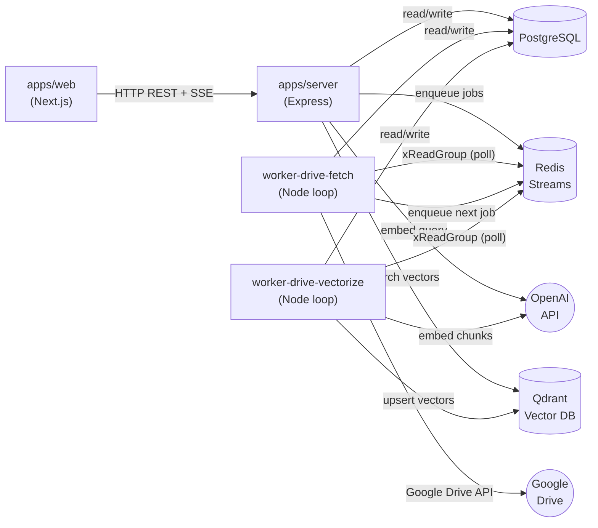

**Key principle:** The web frontend never touches PostgreSQL, Qdrant, or Redis directly. The Express server acts as a single gateway (Backend-For-Frontend pattern). This keeps the frontend simple and lets you swap databases without touching UI code.

---

## 3. Core Concepts

### 3.1 Embeddings

An embedding turns text into an array of ~1536 floating-point numbers that capture the *semantic meaning* of the text.

```
"Q3 revenue grew 12%"  →  [0.023, -0.041, 0.892, 0.156, ..., -0.034]  (1536 numbers)
"Sales increased 12%"  →  [0.019, -0.038, 0.887, 0.149, ..., -0.031]  (very similar!)
"The cat sat on a mat" →  [0.412, 0.891, -0.233, 0.056, ..., 0.778]   (very different)
```

If two pieces of text have similar meaning, their vectors point in similar directions in 1536-dimensional space.

**Model used:** `text-embedding-3-small` (OpenAI)

### 3.2 Cosine Similarity

Qdrant uses **Cosine similarity** to compare vectors. It measures the *angle* between two vectors:

```
Cosine Similarity = 1.0  →  Identical meaning
Cosine Similarity = 0.5  →  Loosely related
Cosine Similarity = 0.0  →  Unrelated
Cosine Similarity = -1.0 →  Opposite meaning
```

**Why not Euclidean distance?** Cosine measures *direction* (meaning), Euclidean measures *magnitude* (length). Two sentences with the same meaning but different lengths would have different Euclidean distances but similar cosine similarity. Think of it as arrows - two arrows pointing the same direction = same meaning, regardless of their length.

### 3.3 Score Threshold (0.4)

In `driveRetrieveTool`, we use `score_threshold: 0.4`. This controls the precision-recall tradeoff:

| Threshold | Behavior |
|-----------|----------|
| **0.9** | Strict - only near-identical matches. Misses many useful results. |
| **0.4** | Moderate - accepts remotely related content. Good balance. |
| **0.0** | Loose - returns everything including garbage. |

### 3.4 Chunking

Documents are split into chunks of **800 tokens** with **100-token overlap** using tiktoken's `cl100k_base` encoding.

```
Document: "The quick brown fox jumps over the lazy dog. The dog barked..."
                                   
Chunk 0: [token 0 ──────── 799] + [token 700 ── 799]  ← overlap  
Chunk 1:            [token 700 ── 799] + [token 800 ──────── 1599] + [overlap]  
Chunk 2:                                          [overlap] + [token 1500 ──── 2399]
```

**Why 800 tokens?** Small enough to be semantically focused (a chunk about "revenue" won't also contain paragraphs about "hiring"). Large enough to carry meaningful context. At 100 tokens you'd shred sentences mid-thought. At 4000 you'd have too many topics per chunk - the embedding would be a blur.

**Why 100-token overlap?** Prevents losing information at boundaries. If a key sentence straddles two chunks, the overlap ensures it appears whole in at least one.

**Why prepend the file title?** Each chunk is embedded as `"Title: filename.pdf\n\n{chunk text}"`. This gives the embedding model context about *what document* this chunk belongs to. Without it, a chunk saying "revenue grew 12%" has no idea if it's from the Q3 report or the annual plan.

---

## 4. The RAG Pipeline - Document Ingestion

This is how a Google Drive file goes from a file to a searchable vector.

### Full Ingestion Flow

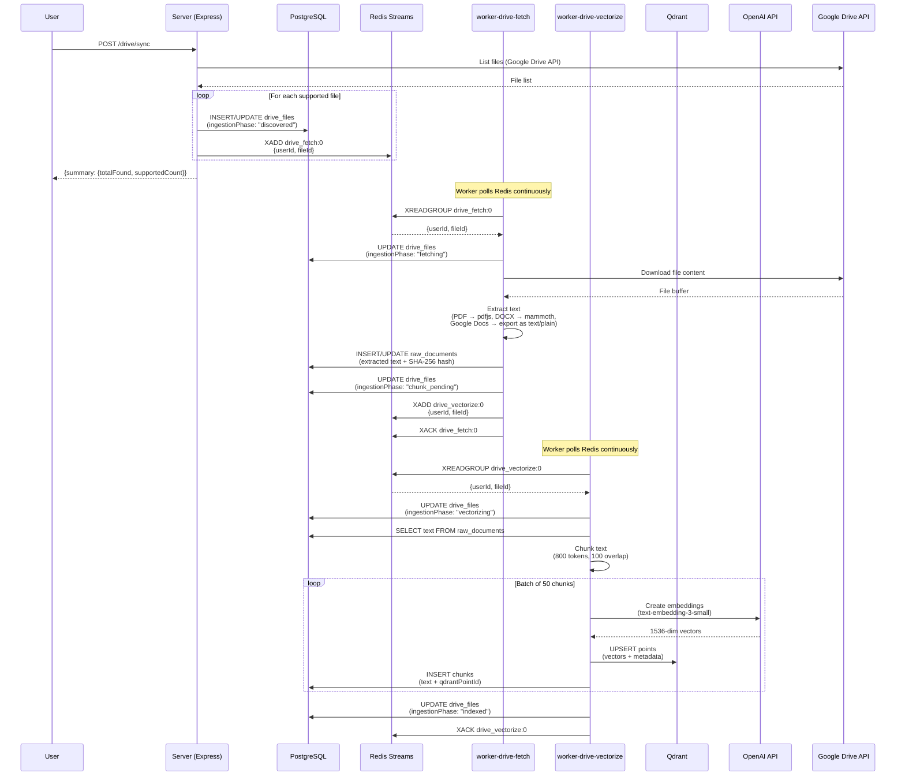

### Ingestion State Machine

Each file goes through a well-defined state machine. This gives observability and retry precision.

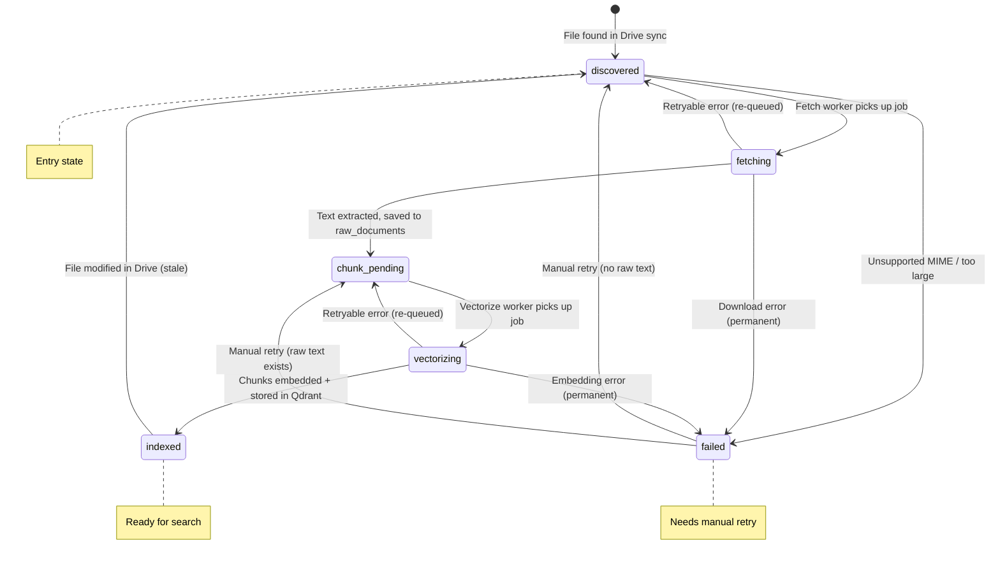

**Why not just a boolean `isIndexed`?** With 6 states, you know *exactly* where ingestion failed. If a file is stuck at "fetching", the fetch worker crashed. If stuck at "vectorizing", the embedding API had issues. A boolean would tell you it failed, but not whether to retry from fetch or from vectorize.

### Retry Logic

```mermaid
flowchart TD
    A[Job fails] --> B{HTTP status 4xx?}
    B -->|Yes| C[Permanent failure]
    B -->|No| D{retryCount >= 2?}
    D -->|Yes| C
    D -->|No| E[Increment retryCount]
    E --> F[Re-enqueue with exponential backoff<br/>2s → 4s → 8s]
    C --> G[Set ingestionPhase: "failed"]
    G --> H["Manual retry via POST /drive/files/:id/retry"]
    H --> I{raw_documents exists?}
    I -->|Yes| J[Reset to chunk_pending<br/>Re-enqueue vectorize]
    I -->|No| K[Reset to discovered<br/>Re-enqueue fetch]
```

### File Types Supported

| MIME Type | Extraction Method |
|-----------|------------------|
| `application/pdf` | `pdfjs-dist` - extracts text per page |
| `application/vnd.google-apps.document` | Google Drive export as `text/plain` |
| `application/vnd.google-apps.spreadsheet` | Google Drive export as `text/csv` |
| `application/vnd.google-apps.presentation` | Google Drive export as `text/plain` |
| `application/vnd.openxmlformats-officedocument.wordprocessingml.document` | `mammoth` - DOCX to text |
| `text/*`, `application/json`, `application/csv` | Direct UTF-8 decode |

Files are truncated at **100,000 characters** to prevent runaway memory usage.

---

## 5. The Query Flow - How a Question Gets Answered

This is the main user-facing flow - from asking a question to getting a cited answer.

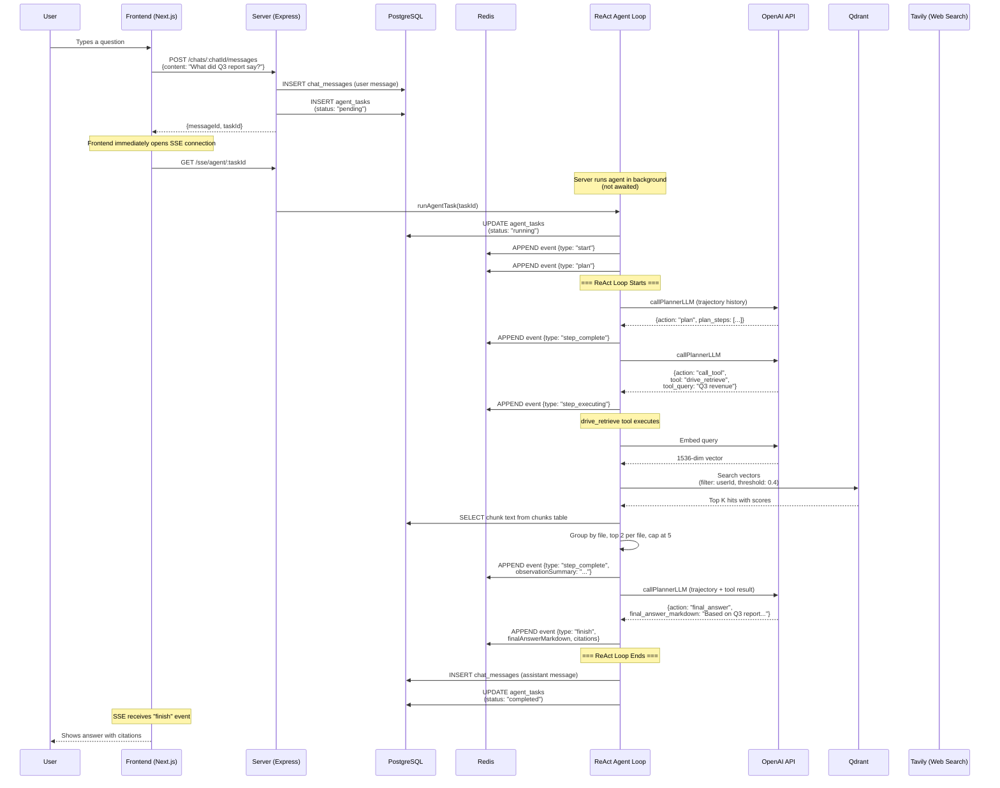

### What Happens When Drive Returns Nothing

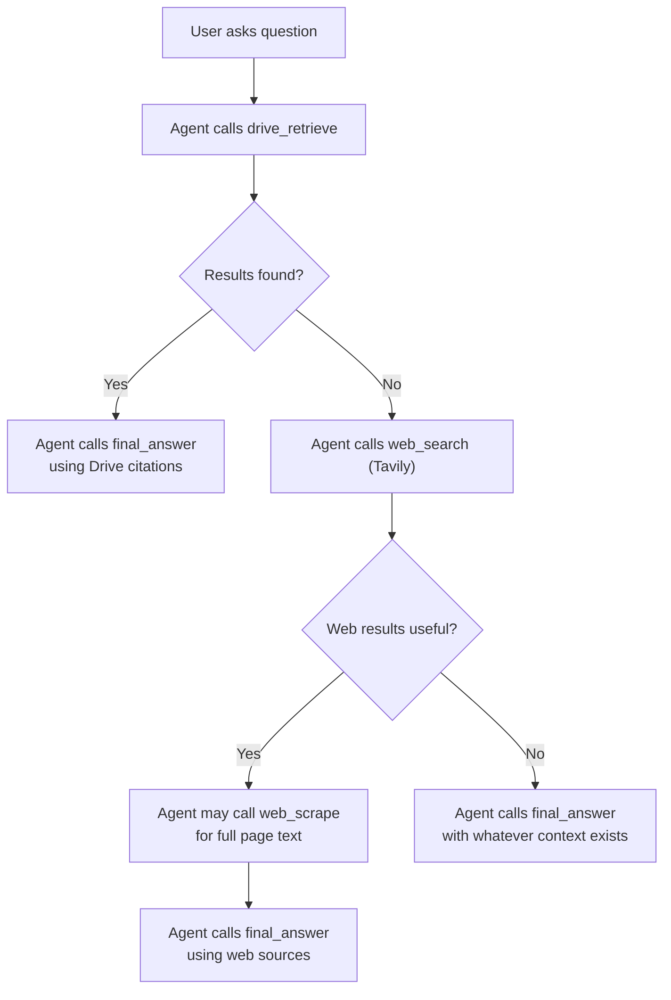

---

## 6. The ReAct Agent Loop

The agent uses the **ReAct (Reason + Act)** pattern: it thinks, picks a tool, observes the result, then thinks again.

### Loop Flow

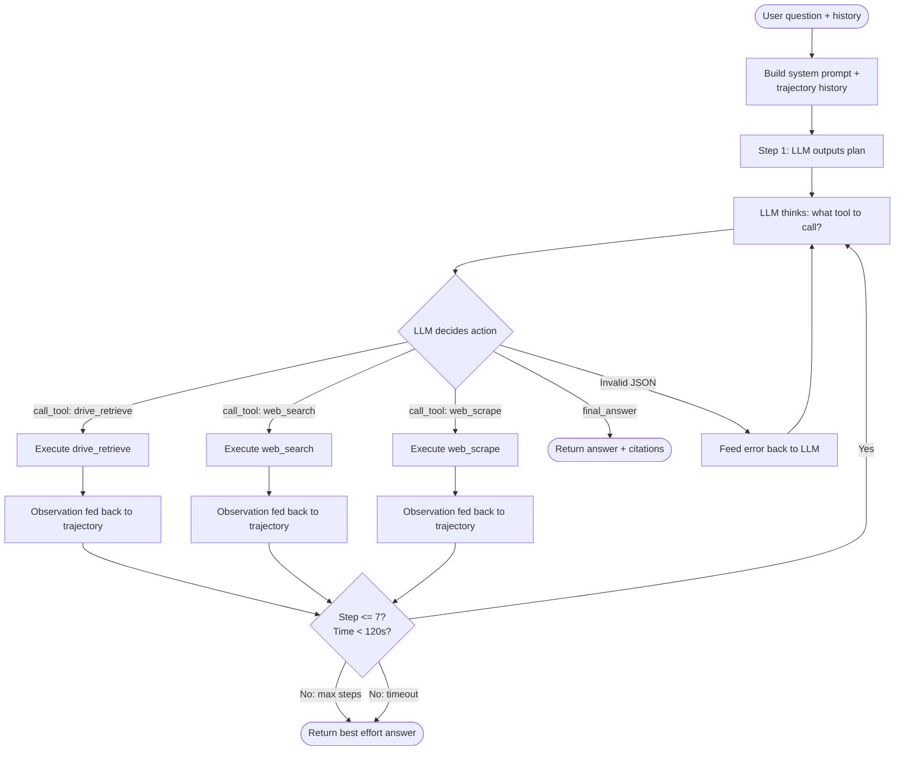

### Available Tools

| Tool | Purpose | When Called |
|------|---------|-------------|
| `drive_retrieve` | Semantic search over user's Google Drive documents | **Always first.** Mandatory before any other tool. |
| `web_search` | Search the web via Tavily API | Only after drive_retrieve returns nothing useful. |
| `web_scrape` | Extract text from a specific URL using Puppeteer | After web_search, when full page content is needed. |

### Guardrails

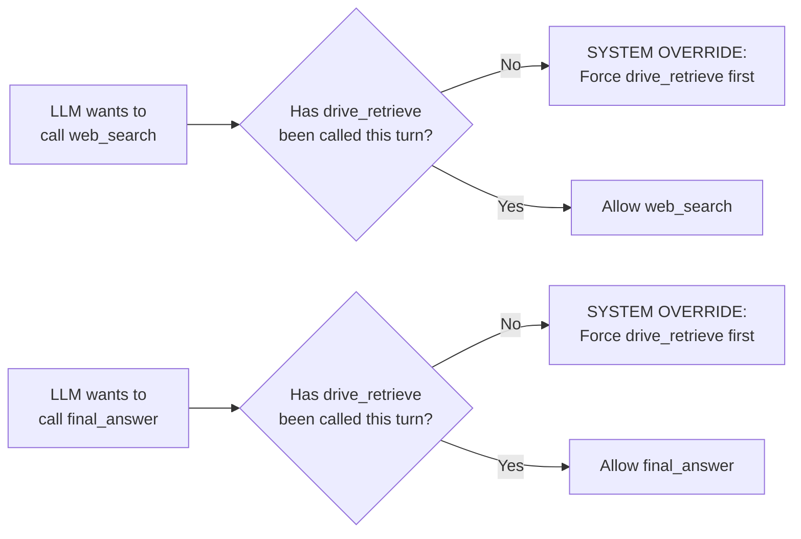

The **drive-first guard** exists because LLMs (trained on internet data) gravitate toward web search by default - it's easier for them. But Sasori's value is searching *your documents*. The system prompt and code-level guard both enforce this.

### Trajectory History

The agent maintains a full conversation trajectory:

```
[System prompt]           ← Defines the agent's behavior and available tools
[User message history]    ← Previous messages in the chat
[Current user question]   ← What the user just asked
---
[Assistant: plan JSON]    ← Agent plans
[User: "Proceed"]         ← System acknowledges plan
[Assistant: tool JSON]    ← Agent calls a tool
[User: tool result]       ← Tool output fed back
[Assistant: final JSON]   ← Agent gives final answer
```

Every step appends to this trajectory so the LLM remembers its previous decisions. This is how the agent is "self-aware" of what it has already tried.

### Safety Limits

| Limit | Value | Reason |
|-------|-------|--------|
| Max steps | 7 | Enough for plan + retrieve + web_search + scrape + answer. Prevents runaway loops. |
| Max runtime | 120s | Prevents burning tokens forever on stuck tasks. |
| Max concurrent tasks | 10 | Prevents server overload. |
| LLM call timeout | 15s | Prevents waiting on a hung OpenAI API call. |
| Redis xAdd timeout | 5s | Prevents blocking on Redis issues. |
| SSE stream TTL | 15 min | Cleans up Redis streams after the answer is safely in PostgreSQL. |

---

## 7. Real-Time Streaming (SSE)

### How SSE Works

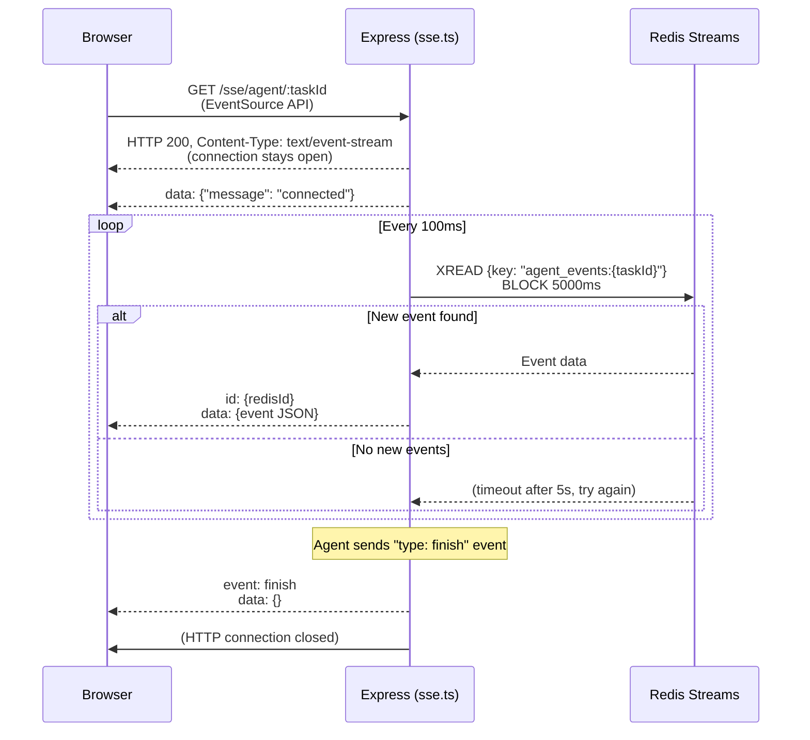

### Why SSE instead of WebSockets?

| | SSE | WebSockets |
|---|---|---|
| Direction | Server → Client only | Bidirectional |
| Protocol | Plain HTTP | Upgrade to WS protocol |
| Auto-reconnect | Built-in | Must implement manually |
| Complexity | Simple | Complex (connection management, ping/pong) |
| Best for | Real-time updates, feeds | Chat apps, multiplayer games |

Sasori's agent never needs to receive data *from* the frontend during execution. It's a one-way firehose of events. SSE is the simpler, correct choice.

### Event Types

The agent emits these event types during execution:

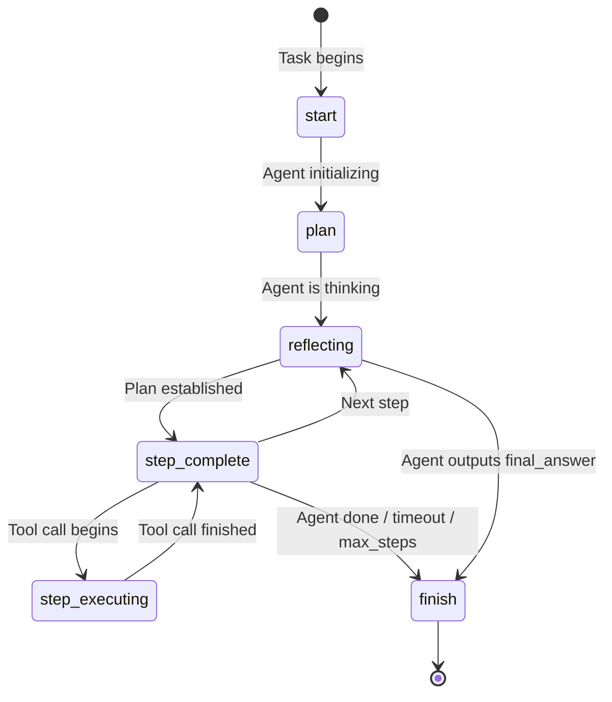

Each event is pushed to Redis Stream `agent_events:{taskId}` and has a 15-minute TTL. The final answer is persisted in PostgreSQL independently, so even if the Redis stream expires, the data is not lost.

---

## 8. Data Model

### Entity Relationship Diagram

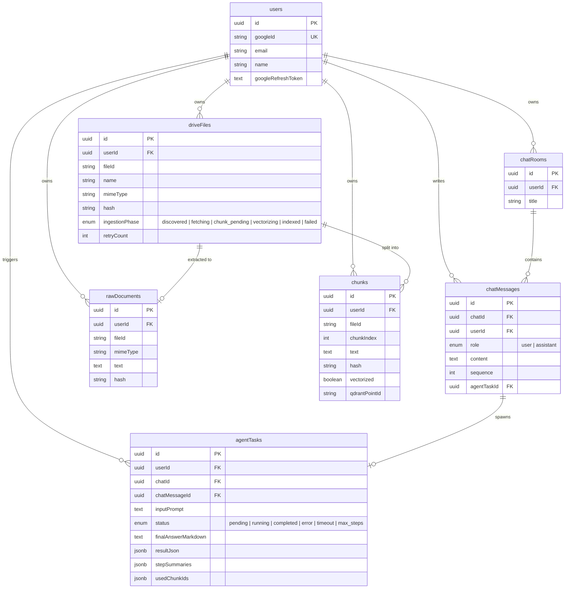

### Why agentTasks is Separate from chatMessages

One message = one task, but the task carries heavy state:
- `stepSummaries` - full ReAct loop history
- `resultJson` - citations and tool results
- `usedChunkIds` - which chunks were referenced
- Retry status, timing, error details

Stuffing all this into `chatMessages` would bloat every row, even simple "thanks" messages. Separation also lets you query tasks independently (e.g., "show me all failed tasks in the last hour").

### Why Hash Everything

Every `driveFile`, `rawDocument`, and `chunk` has a SHA-256 hash. Hashes serve three purposes:

1. **Change detection** - If a Drive file was modified but the text hash is identical, skip re-indexing
2. **Idempotency** - Prevents duplicate chunks from being inserted
3. **Deduplication** - Identical content across files gets the same hash

---

## 9. Infrastructure and Services

### Service Responsibilities

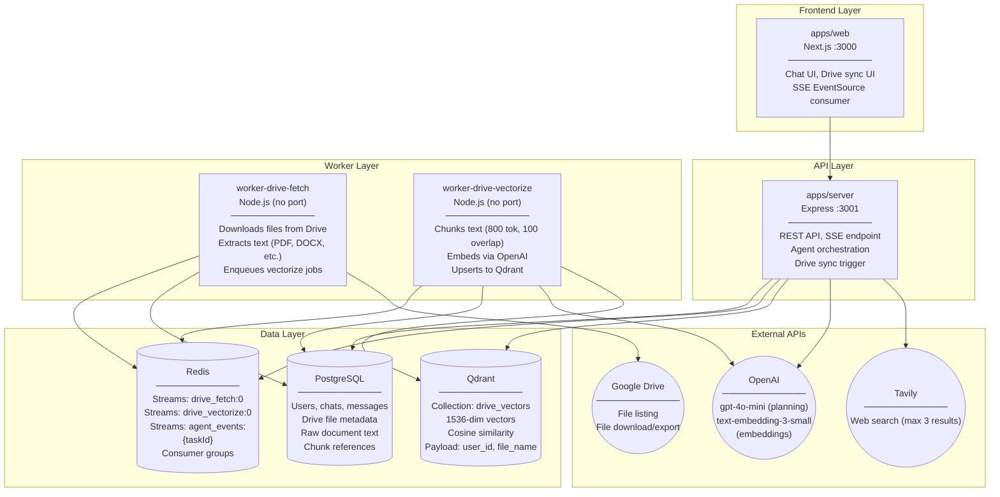

### Redis Stream Topology

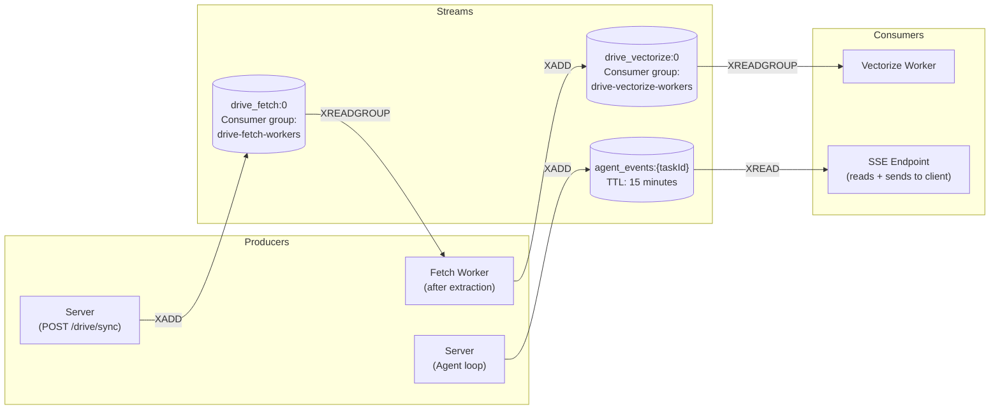

### Docker Compose

Currently only Redis is containerized:

```yaml
services:
  redis:
    image: redis:alpine
    container_name: sasori-redis
    restart: always
    ports:
      - "6379:6379"
```

PostgreSQL and Qdrant run externally (or locally installed). All connections are configured via environment variables.

---

## 10. Monorepo Structure

```
sasori/
├── apps/
│   ├── web/                        # Next.js frontend
│   │   ├── app/
│   │   │   ├── chat/               # Chat pages + [id] dynamic route
│   │   │   ├── login/              # Auth page
│   │   │   └── layout.tsx          # Root layout
│   │   ├── components/
│   │   │   ├── chat/               # MessageList, AgentThoughtLoader, CitationModal
│   │   │   ├── drive/              # DriveSyncModal, IndexedDocsModal, DocumentPreview
│   │   │   ├── layout/             # Navbar, Sidebar, Footer
│   │   │   └── auth/               # AuthContext
│   │   └── lib/
│   │       └── apiClient.ts        # HTTP client to Express server
│   │
│   ├── server/                     # Express API server
│   │   └── src/
│   │       ├── agent/
│   │       │   ├── loop.ts         # ReAct agent loop (the brain)
│   │       │   ├── runAgentTask.ts # Agent lifecycle orchestrator
│   │       │   └── runTaskMock.ts  # Mock agent for testing
│   │       ├── llm/
│   │       │   ├── openai.ts       # OpenAI client + callPlannerLLM + getEmbedding
│   │       │   └── embedding.ts    # Batch embedding utility
│   │       ├── tools/
│   │       │   ├── driveRetrieve.ts # Semantic search over Drive docs
│   │       │   ├── web_search.ts   # Tavily web search
│   │       │   ├── web_scrape.ts   # Puppeteer page scraping
│   │       │   └── vectorSearch.ts # Low-level vector search
│   │       ├── chat/
│   │       │   └── service.ts      # Chat CRUD + message + task creation
│   │       ├── drive/
│   │       │   ├── client.ts       # Google Drive API client
│   │       │   └── routes.ts       # Drive sync + file management endpoints
│   │       ├── routes/
│   │       │   ├── chats.ts        # Chat REST endpoints
│   │       │   ├── tasks.ts        # Task status + events endpoints
│   │       │   ├── sse.ts          # SSE streaming endpoint
│   │       │   └── debug.ts        # Debug utilities
│   │       ├── auth/
│   │       │   ├── google.ts       # Google OAuth
│   │       │   └── middleware.ts   # Auth middleware
│   │       └── index.ts            # Express app setup + health check
│   │
│   ├── worker-drive-fetch/         # Background worker: download + extract text
│   │   └── src/
│   │       ├── index.ts            # Redis consumer loop + text extraction
│   │       └── utils/envChecker.ts
│   │
│   └── worker-drive-vectorize/     # Background worker: chunk + embed + upsert
│       └── src/
│           ├── index.ts            # Redis consumer loop + chunking + embedding
│           └── utils/envChecker.ts
│
├── packages/
│   ├── db/                         # Drizzle ORM + PostgreSQL
│   │   └── src/
│   │       ├── schema.ts           # All table definitions
│   │       └── index.ts            # DB client + health check
│   │
│   ├── qdrant/                     # Qdrant vector DB client
│   │   └── src/
│   │       └── index.ts            # Client init, upsert, search, health check
│   │
│   ├── redis/                      # Redis Streams wrapper
│   │   └── src/
│   │       └── index.ts            # Stream ops, consumer groups, agent events
│   │
│   ├── zod-schema/                 # Shared validation schemas
│   │   └── src/
│   │       ├── agent.ts            # AgentEvent, Citation, StepSummary schemas
│   │       └── tools.ts            # Tool input schemas
│   │
│   ├── ui/                         # Shared React components
│   │   └── src/                    # Button, Card, Code components
│   │
│   ├── typescript-config/          # Shared tsconfig files
│   └── eslint-config/              # Shared ESLint configs
│
├── docker-compose.yaml             # Redis container
├── turbo.json                      # Turborepo pipeline config
├── pnpm-workspace.yaml             # Monorepo workspace config
└── package.json                    # Root scripts (build, dev, lint)
```

### Package Dependencies

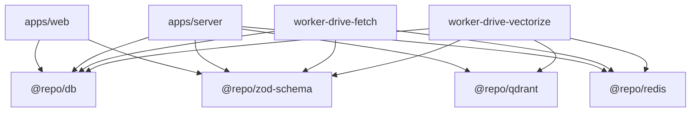

---

## 11. Key Decisions and Tradeoffs

| Decision | Choice | Alternative | Why |
|----------|--------|-------------|-----|
| Monorepo | Turborepo + pnpm | Separate repos | Shared packages (db, redis, schemas) across all apps |
| Vector DB | Qdrant | Pinecone, Weaviate | Self-hosted, free, good filtering support |
| Embeddings | text-embedding-3-small | text-embedding-3-large | Cheaper, 1536 dims is sufficient for semantic search |
| LLM | gpt-4o-mini | gpt-4o | 10-30x cheaper. Good enough for ReAct tool selection |
| Job Queue | Redis Streams (raw) | BullMQ | Learning purpose - understanding the primitives. BullMQ is built on Redis anyway |
| Chunking | tiktoken (800 tokens, 100 overlap) | LangChain text splitter | Direct control, no heavy dependency |
| Web search | Tavily | SerpAPI, Brave | Simple API, good for MVP |
| Web scraping | Puppeteer | Cheerio, Playwright | Handles JS-rendered pages |
| Frontend | Next.js | Plain React | File-based routing, SSR if needed |
| ORM | Drizzle | Prisma | Lightweight, SQL-like, good TypeScript support |
| Real-time | SSE | WebSockets | Unidirectional is sufficient. Simpler, auto-reconnects |

---

## 12. What I Know vs What I Learned

### What I Built and Understand Well

- **RAG fundamentals**: Embeddings, vector search, chunking, and why each piece exists
- **ReAct agent pattern**: Dynamic tool selection, trajectory history, self-correction
- **Redis Streams**: Consumer groups, XADD/XREADGROUP/XACK, job queuing
- **PostgreSQL schema design**: Normalized tables, state machines, hash-based deduplication
- **Chunking strategy**: Token-based splitting with overlap, title prepending for context
- **Cosine similarity vs Euclidean**: Direction vs magnitude, and why threshold 0.4 is a good balance
- **Drive-first guard**: Why the LLM must search your docs before the web
- **Separation of concerns**: Frontend → API → DB, workers as independent processes

### What I Learned Through This Project

- **SSE vs WebSockets**: SSE is unidirectional (server→client), simpler, built on plain HTTP. WebSockets are bidirectional and more complex. For a one-way event stream, SSE is the right choice.
- **Why `response_format: { type: "json_object" }` matters**: Forces OpenAI to return valid JSON. Without it, the model wraps output in conversational filler that breaks `JSON.parse`.
- **Defensive backtick stripping**: Even with `json_object` mode, LLMs can be unreliable. The regex that strips markdown codeblocks is a safety net.
- **Context window management**: Capping at 5 files × 2 chunks prevents the "lost in the middle" phenomenon where LLMs forget information in the middle of long prompts.
- **State machine granularity**: 6 ingestion states seem like overkill until you need to know whether to retry from fetch or from vectorize.

### What I Still Need to Learn

- **Production deployment**: How to run each service as a container, horizontal scaling, monitoring
- **PEL recovery**: Redis Streams have a Pending Entries List for crashed workers, but I don't have an XPENDING/XCLAIM sweep in my code yet
- **Advanced RAG techniques**: Re-ranking, hybrid search (keyword + semantic), query transformation
- **Cost optimization**: Batching embeddings, caching frequent queries, smarter chunking strategies
